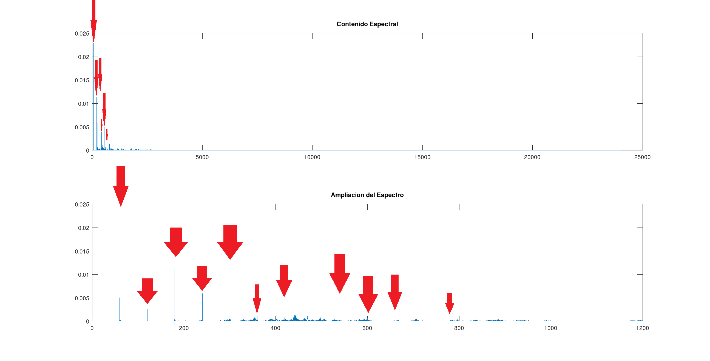
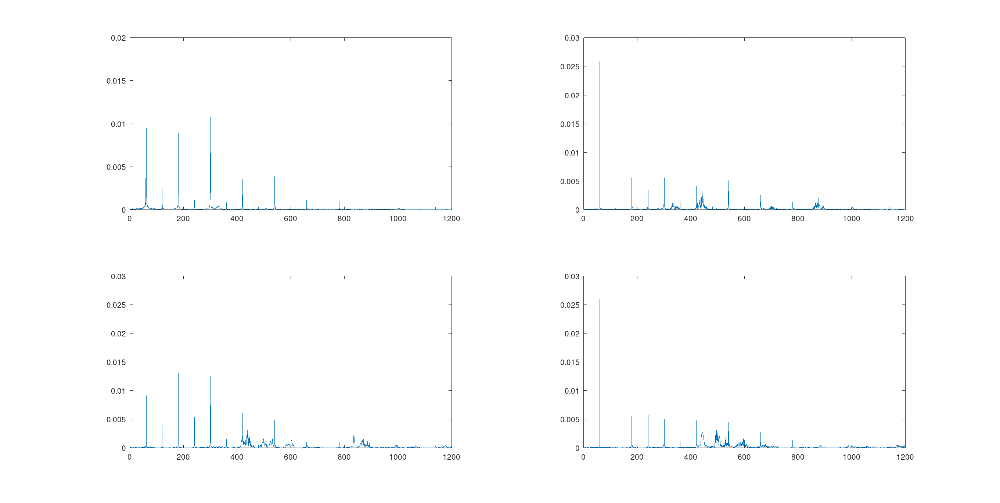
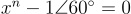
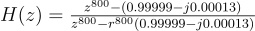
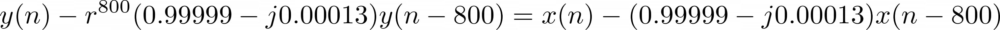
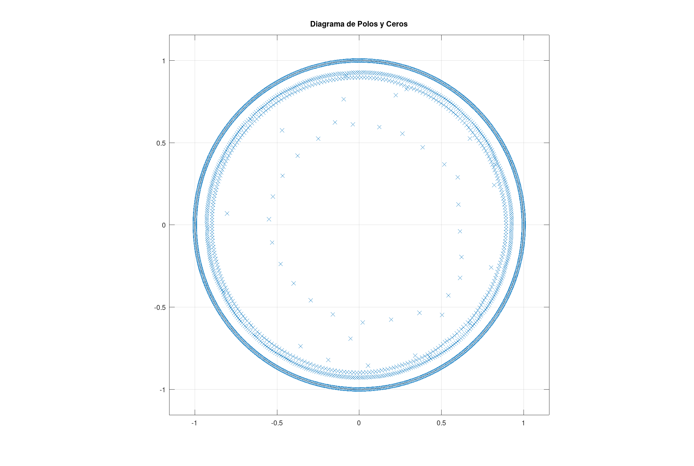
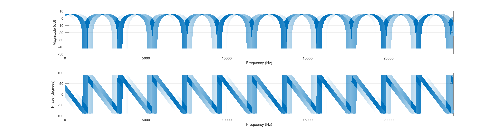

# Sistema de Supresión de Ruido de Red Eléctrica

A continuación se presentan los resultados para la tarea 5 del curso DSP.

## Contexto: audio con ruido electrico
El audio a procesar corresponde a un segmento de "La Muerte del Ángel" muestreada a 48 kHz según las propiedades del archivo. El audio se ve fuertemente afectado por ruido electrico, es decir componentes armónicos de la frecuencia fundamental de 60 Hz. Dicho efecto se puede apreciar en la parte superior de ka figura 1, donde se visualiza todo el espectro del audio. Sin embargo, solo un segmento contiene la mayor parte de la información como se ve en el subplot inferior.

*Figura 1*

Se señalan las componentes parasitas con flechas rojas y se ubican en 60 Hz, 120 Hz, 180 Hz... hasta terminar el espectro, sin embargo el efecto de las componentes bajas es mucho mayor que las altas.

En la figura 2 se incluyen 4 ventanas sucecivas del audio, se puede notar como el contenido espectral cambia en cada ventana.

*Figura 2*

## Filtro Propuesto

El primer acercamiento correspondía a una serie de ceros y polos complejos conjugados, cuyo efecto no fue mayor y resultó dificil de integrar para mas de 3 pares cada uno, por lo que se optó como segunda propuesta por un "Peine" de polos y ceros. los ceros corresponden a n soluciones complejas a la igualdad

donde n debe estar distanciado adecuadamente. Para calcular el distanciamiento se toma el espectro completo y se divide por 60 Hz, así se obtienen el número de armónicos totales en el espectro y el número de ceros necesarios (800 en total). Lo mismo se propone para los polos, que permiten compensar el efecto de los ceros. Como no se puede colocar el polo en el circulo unitario, se propone un radio r parametrizable tal que r sea menor que 1 con el mismo angulo que los ceros.

Finalmente, se obtienen los siguientes valores:

**Función de Transferencia**

 
**Ecuación de Diferencias**

**Diagrama de Polos (para r = 0.9)**

**Respuesta en Frecuencia (para r = 0.9)**

